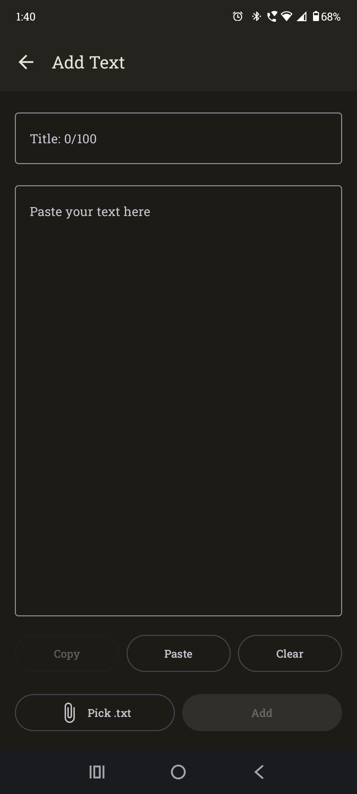
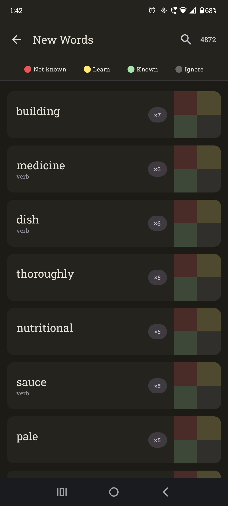
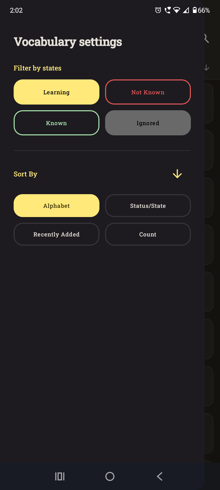
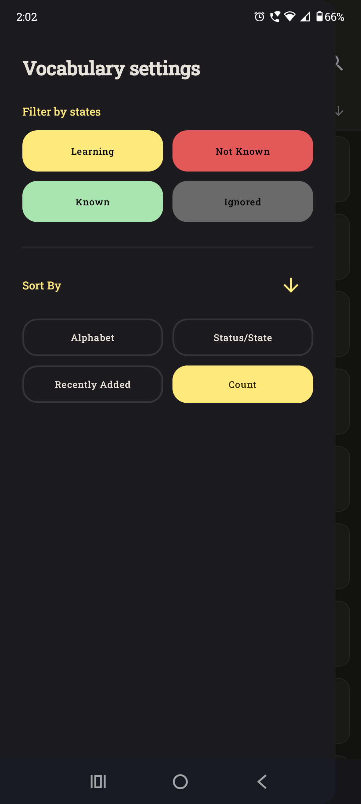
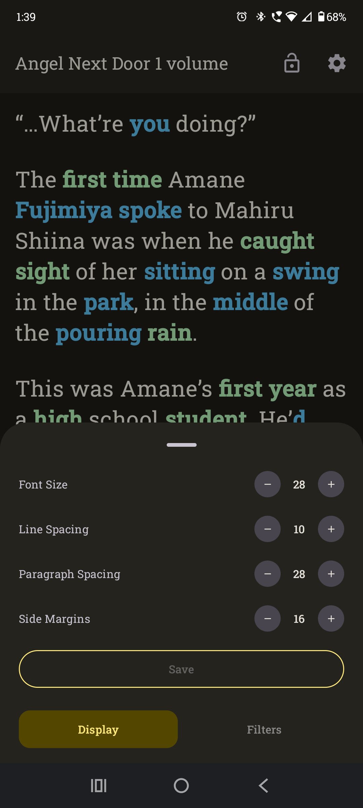
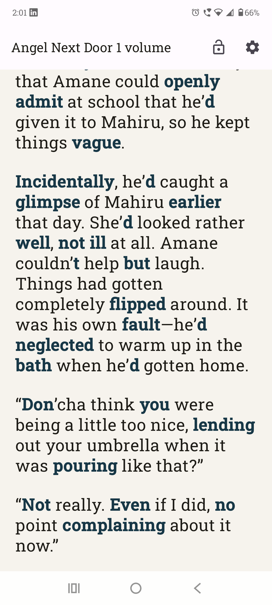

# VocaBanana

**VocaBanana** is an English vocabulary management tool built around **your own texts**.

Read the texts you actually want to read, build your personal vocabulary from them, and track how your vocabulary develops over time.

> **Learn vocabulary from your texts, not from random word lists.**

VocaBanana is not primarily a flashcard or memorization app. It focuses on **vocabulary tracking and reading** — helping you find, organize, and follow the words you encounter in real content.

---

## Core Idea

VocaBanana lets you turn the texts you already want to read into a source for your personal vocabulary.

Instead of studying pre-made word lists, you choose the content yourself:

```text
Your text
   ↓
Vocabulary generated from the text
   ↓
Review and classify words
   ↓
Read the text with vocabulary filters
   ↓
Track your vocabulary progress
```

The more you use VocaBanana, the more useful your personal vocabulary database becomes.

---

## Who Is It For?

VocaBanana can be useful for anyone learning English, but it is especially suited for learners around **A2 level and above** who:

* already understand basic English;
* want to read books, articles, subtitles, and other English content;
* want to build vocabulary from content they actually care about;
* prefer controlling their own vocabulary instead of using pre-made word lists.

At least, that's exactly who it was intended for

---

## How to Use

### 1. Create a Text

Open the **Texts** section and create a new text.

Give it a title and add your content. You can either:

* paste text directly;
* import a `.txt` file.

Then open the text to start reading.



---

### 2. Open the Text

The first time you open a text, VocaBanana automatically analyzes its content and generates vocabulary from it.

The generated vocabulary is based on the words found in your text rather than a pre-built word list.

VocaBanana also attempts to **lemmatize words**, grouping different forms of the same word where possible.

For example:

```text
fishing
fished
fish

      ↓

fish
```

For large texts, VocaBanana also aims to reduce the vocabulary to words that are more relevant and frequent, rather than making you review every single word occurrence.

---

### 3. Review New Words

After opening the text, go to **Vocabulary** and open the **New Words** section.

Here you can review the words extracted from your text and assign a status to each one.

Available statuses:

* **Known** — you already know the word;
* **Learning** — you know it partially or want to learn it;
* **Unknown** — you do not know the word;
* **Ignored** — you do not want the word to be part of your vocabulary.

For example, a person's name, surname, unusual proper noun, or simply an irrelevant word can be marked as **Ignored**.

You can also leave a word unchanged if you do not want to classify it yet.



---

### 4. Read with Vocabulary Filters

Return to your text and open its **Filters**.

You can choose which vocabulary statuses you want to focus on while reading.

For example, you can display only:

* New words;
* Learning words;
* Known words;
* Ignored words.

This allows you to read the same text in different ways depending on what you want to focus on.




---

### 5. Customize the Reading Experience

VocaBanana lets you adjust the appearance of your text to make longer reading sessions more comfortable.

You can change:

* **Font size**
* **Line spacing**
* **Paragraph spacing**
* **Side margins**




---

### 6. Explore Words While Reading

You can tap a word directly while reading to view information about it.

Depending on the available data, you can see:

* its vocabulary status;
* part of speech;
* definition;
* other word forms;
* when the word was added.

You can also edit this information manually or open an external dictionary resource when needed.

---

## Vocabulary

Your **Vocabulary** section contains your personal vocabulary database.

You can:

* view your words;
* change their learning status;
* edit word information;
* add or change definitions;
* change the part of speech;
* view other word forms;
* see when a word was added;
* search, filter, and sort your vocabulary.

### Search

VocaBanana provides a flexible word search that can help when you do not remember the exact spelling of a word.

For example, you can search using parts of a word, including consonant patterns, and VocaBanana can find matching words even when other letters appear between them.

### Filter and Sort

You can filter your vocabulary by status and sort it by different properties, such as:

* alphabetical order;
* status;
* date added;
* frequency.

---

## Vocabulary Progress

VocaBanana provides an overview of your personal vocabulary using statistics and charts.

You can see how many words are:

* Known;
* Learning;
* Unknown;
* Ignored.

The goal is not simply to collect as many words as possible, but to help you understand how your vocabulary changes as you continue reading.

---

## Offline by Default

VocaBanana is designed to work **without an internet connection**.

Your texts and vocabulary are stored locally on your device, and normal reading and vocabulary management do not require an internet connection.

---

## Optional Cloud Backup

If you want an additional backup, you can optionally save your data to **Google Drive**.

Cloud backup is not required to use VocaBanana.

To create a backup:

1. Open the cloud backup settings;
2. Sign in with your Google account;
3. Choose **Save Cloud Backup** in the main menu;

Your local data remains the primary source of your vocabulary and texts.

---

## English-Only Interface

VocaBanana currently uses English throughout the application.

The interface is intentionally kept in English to support a more immersive learning experience and avoid unnecessary translation while using the app.

---

## Recommended Usage

VocaBanana works particularly well when you read content that is related to your interests.

For example, you can collect several books from the same author or from a similar genre and add them to VocaBanana.

As you continue reading, you will encounter many of the same words again. Words that were unfamiliar before can gradually become familiar, while VocaBanana helps you keep track of that progress.

---

## Architecture

VocaBanana uses a modular, feature-oriented architecture with clear separation between application features and shared infrastructure.

For a detailed explanation of the project architecture, module structure, and development approach, see:

**[ARCHITECTURE.md](https://github.com/San1ch/VocaBanana/blob/master/ARCHITECTURE.md)**

---

## Installation

Download the latest release from GitHub and install the APK on your Android device.

**[Download the latest release](https://github.com/San1ch/VocaBanana/releases/tag/v1.0.0)**

---

## Current Status

VocaBanana is currently in active development.

The core workflow is already implemented and usable, while additional vocabulary, learning, and analytics features are still being developed.

---

## Planned Features

* Vocabulary statistics improvements;
* Vocabulary grouped by text;
* Translation exercises;
* Sentence-based practice;
* Vocabulary-based exercises;
* AI-assisted learning tools;
* Extended progress analytics.

---

## Contributing

VocaBanana is currently maintained as a personal learning and portfolio project. External contributions are not being accepted at this time.

---

## Author

**San1ch**

[GitHub](https://github.com/San1ch)
